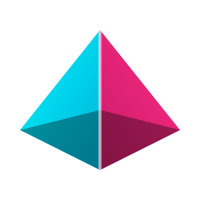

# Vítejte v OSIRIS Wiki

<div align="center">



### Jednotná vizuální identita a designový systém OSIRIS
**Jeden repozitář pro kompletní ekosystém vývojářského prostředí**  
*VS Code &bull; GTK 3/4 &bull; GNOME Shell &bull; KDE Plasma / Qt &bull; VitePress &bull; Bootstrap 5 &bull; Prohlížeče &bull; GRUB2 &bull; Tapety*

[Interaktivní živý náhled designu &rarr;](https://richardblaha.github.io/osiris-theme/)

</div>

---

## O projektu OSIRIS

**OSIRIS** představuje ucelený designový systém a téma navržené primárně pro vývojáře, inženýry a technické tvůrce. Základním cílem projektu je eliminovat vizuální fragmentaci na desktopu i webu a nabídnout **jeden jednotný zdroj pravdy** (`assets/tokens.json`), ze kterého se automaticky generují motivy pro všechna klíčová prostředí:

- **Vývojová prostředí:** VS Code (barevné téma, sady souborových i produktových ikon).
- **Desktopová prostředí (Linux):** GTK 3.0 / 4.0, libadwaita, GNOME Shell, Metacity/Marco, KDE Plasma 6 (barevná schémata, Kvantum, Aurorae, desktoptheme), VTE terminály (GNOME Terminal, Ptyxis, Konsole).
- **Web a dokumentace:** VitePress (oficiální téma dokumentace), Bootstrap 5 (Sass proměnné a komponenty), Forgejo / Gitea (tmavé, světlé a auto CSS téma).
- **Webové prohlížeče:** Google Chrome, Chromium, Microsoft Edge a Mozilla Firefox.
- **Systémový start:** GRUB2 bootloader motiv s vlastní grafikou a typografií.
- **Vizuální podklad:** Tapety ve dvou rodinách (Abstract a Egypt) s dynamickými přechody den/noc.

---

## Manuál grafického designu (Rozcestník)

Tato Wiki slouží jako **oficiální manuál grafického designu** projektu OSIRIS. Jednotlivé kapitoly pokrývají kompletní specifikaci vizuálního jazyka:

| Kapitola | Popis |
|---|---|
| **[1. Manuál grafického designu](Manual-grafickeho-designu.md)** | Filozofie designu, konstrukce loga, ochranné zóny, pravidla použití a zakázané manipulace. |
| **[2. Barevná paleta a tokeny](Barevna-paleta-a-tokeny.md)** | Dual-accent koncepce (Cyan & Rose), neutrální rampy pro Dark/Light, sémantické barvy a syntax highlighting. |
| **[3. Typografie](Typografie.md)** | Výhradní písmo Fira Code, typografická hierarchie, pravidla pro řezy, velikosti a ligatury. |
| **[4. Komponenty a UI stavy](Komponenty-a-UI-stavy.md)** | Tvarosloví (rádiusy), elevace, stíny, standardizovaný Focus Ring a interaktivní kontrakt komponent. |
| **[5. Ikonografie](Ikonografie.md)** | Pravidla Papirus Icon Theme, 24x24 mřížka, souborové i systémové XDG ikony. |
| **[6. Tapety a vizuální aktiva](Tapety-a-vizualni-aktiva.md)** | Kolekce tapet Abstract a Egypt, letterpress vodoznaky a systémové ikony. |
| **[7. Galerie a screenshoty](Galerie-a-screenshoty.md)** | Vizuální prezentace tmavého a světlého motivu v reálném rozhraní, popis klíčových zón. |
| **[8. Architektura a export](Architektura-a-export.md)** | Způsob generování motivů z `tokens.json`, strom repozitáře a kontrola integrity (CI guard). |

---

## Základní stavební kameny identity

```text
┌─────────────────────────────────────────────────────────────────────────┐
│                          OSIRIS DESIGN LANGUAGE                         │
├─────────────────────────────────────────────────────────────────────────┤
│  1. DUAL ACCENT     Cyan (#00f2fe / #0969da) + Rose (#ff2a85 / #e01a76) │
│  2. STATUS BAR      Solid Accent Bar (plně barevný podpisový proužek)   │
│  3. SURFACES        Hluboké temné uhlí (#0d1117/#161b22) / Čistá světlá│
│  4. TYPOGRAFIE      Jediné písmo Fira Code všude (včetně UI chrome)     │
│  5. IKONY           Čisté geometrické Papirus Icon Theme (24px mřížka)  │
└─────────────────────────────────────────────────────────────────────────┘
```

> [!TIP]
> Pro interaktivní zkoušení všech komponent, formulářových prvků, IntelliSense a přepínání Dark/Light navštivte **[Online Design System Preview](https://richardblaha.github.io/osiris-theme/)**.

