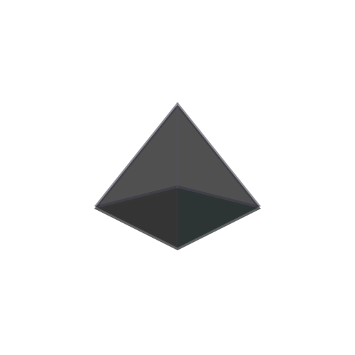

# Manuál grafického designu OSIRIS

Tento dokument představuje **oficiální manuál grafického designu značky OSIRIS**. Definuje pravidla používání loga, symbolů, ochranné zóny, barevných variant a celkové identity napříč všemi digitálními i fyzickými výstupy.

---

## 1. Filozofie a vize značky

Vizuální styl OSIRIS vychází z propojení **precizního inženýrství, moderní kybernetické estetiky a egyptské mystiky**. Není to pouze barevné schéma pro editor kódu, ale komplexní designový jazyk sjednocující operační systém, nástroje a dokumentaci.

### Klíčové principy:
1. **Funkční ergonomie (Developer First):** Všechny barvy, kontrasty a rádiusy jsou optimalizovány pro mnohahodinovou práci bez únavy očí (certifikovaný kontrast WCAG AA).
2. **Dual-Accent identita:** Práce se dvěma kontrastními akcenty – technologický **Cyan** a energická **Rose**.
3. **Jednota (Single Source of Truth):** Žádný prvek nevzniká ad-hoc. Každá hodnota je odvozena ze systémových tokenů.
4. **Monospace jako podpis:** Písmo Fira Code se nepoužívá jen pro kód, ale jako plnohodnotné písmo celého uživatelského rozhraní (UI chrome).

> [!NOTE]
> **Vztah k původnímu balíčku `@osiris/branding`:** Původní legacy paleta používala syrové neony `#00FFFF` / `#FF00FF` na plochém černém pozadí `#121212`. Současný designový systém `osiris-theme` tyto hodnoty překonává jemně tónovaným párem `#00f2fe` a `#ff2a85` na hluboké GitHub neutrální rampě `#0d1117 / #161b22`, což zásadně snižuje oční zátěž a zvyšuje čitelnost.

---

## 2. Anatomie loga a symbolu

Hlavním identifikačním znakem projektu je **krystalický obelisk / polygonální jehlan**, který symbolizuje pevnost, stabilitu a technologickou čistotu.

<div align="center">
  
</div>

### Geometrická konstrukce:
- **Levá fasetová plocha (Primární akcent):** Vyplněna barvou Cyan (`#00f2fe`), reprezentuje interaktivitu, světlo a logiku.
- **Pravá fasetová plocha (Sekundární akcent):** Vyplněna barvou Rose (`#ff2a85`), reprezentuje identitu, akci a energii.
- **Dolní stínovaná plocha:** Tmavý přechodový polygon s krytím 35 % černé, dodávající symbolu prostorovou hloubku.
- **Centrální osa (Apex line):** Vertikální světelná linie (bílá s 60% opacitou), která obě poloviny opticky propojuje a vyvažuje.

```text
               ▲ (100, 30) - Vrchol
              /│\
             / │ \
            /  │  \
   CYAN    /   │   \   ROSE
  #00f2fe /    │    \  #ff2a85
         /     │     \
 (20,130)◄─────┼─────► (180, 130)
          \    │    /
           \   │   /   STÍN (35% černá)
            \  │  /
             \ │ /
               ▼ (100, 170) - Pata
```

---

## 3. Typografické logo (Logotyp)

Logotyp se skládá ze slova **OSIRIS** v primární akcentové barvě nebo bílé a doplňkového slova **THEME** v tlumené barvě:

```text
  OSIRIS THEME
  └────┘ └───┘
  Akcent  Tlumená (text.secondary)
```

- **Písmo:** Fira Code Bold (700) nebo SemiBold (600).
- **Prostrkání (Letter-spacing):** `0.08em` až `0.12em` (široké, technické posazení).
- **Velikost písmen:** Výhradně verzálky (`UPPERCASE`).

---

## 4. Ochranná zóna a minimální velikost

Aby si značka zachovala svou čitelnost a vizuální autoritu, musí být kolem loga vždy zachován volný prostor (ochranná zóna), do kterého nesmí zasahovat text, jiné grafické prvky ani okraj formátu.

```text
┌────────────────────────────────────────────────────────┐
│                        X                              │
│         ┌────────────────────────────┐                │
│         │                            │                │
│    X    │        OSIRIS LOGO         │    X           │
│         │                            │                │
│         └────────────────────────────┘                │
│                        X                              │
└────────────────────────────────────────────────────────┘
```

- **Ochranná zóna (X):** Odpovídá 25 % výšky symbolu (případně šířce písmene "O" v doprovodném nápisu).
- **Minimální digitální velikost:**
  - Samotný symbol (favicon / tray ikona): **16 × 16 px** (ve zjednodušeném renderingu).
  - Standardní UI ikona: **24 × 24 px**.
  - Kompletní logo se symbolem i textem: minimální šířka **140 px** (výška symbolu min. **32 px**).
- **Minimální tisková velikost:**
  - Symbol: výška min. **8 mm**.
  - Kompletní logotyp: šířka min. **35 mm**.

---

## 5. Barevné varianty loga

| Varianta | Podklad | Použití |
|---|---|---|
| **Plnobarevná (Tmavá)** *(Doporučeno)* | `#0d1117`, `#161b22` nebo černá | Výchozí varianta pro web, VS Code, Linux desktop a většinu médií. |
| **Plnobarevná (Světlá)** | `#ffffff`, `#f6f8fa` nebo světle šedá | Aplikace v denním režimu, oficiální dokumenty, tiskové materiály. |
| **Monochromatická bílá** | Tmavé jednolité pozadí, fototapety | Gravírování, sítotisk, jednobarevná razítka. |
| **Monochromatická černá** | Bílý papír, černobílý tisk | Faktury, černobílá technická dokumentace. |

---

## 6. Letterpress a vodoznaky

Součástí vizuálního stylu jsou speciální **letterpress vodoznaky** – reliéfně zapuštěné značky navržené pro jemný podkres panelů, uvítacích obrazovek a systémových dialogů.

- `letterpress-dark.png` / `letterpress-dark@2x.png`: Pro tmavá pozadí, simuluje zapuštění do matného karbonového/uhlíkového podkladu.
- `letterpress-light.png` / `letterpress-light@2x.png`: Pro světlé papírové povrchy, simuluje suchou pečeť (slepotisk).

<div align="center">
  
  
</div>

---

## 7. Zakázané manipulace (Brand Don'ts)

Pro zachování integrity a konzistence identity OSIRIS je přísně zakázáno:

> [!CAUTION]
> - **Nedeformovat proporce:** Nikdy neměňte poměr stran symbolu ani logotypu (žádné horizontální ani vertikální protahování).
> - **Neměnit barvy krystalu:** Nepoužívejte náhodné přechody, zelené, oranžové ani jiné odstíny mimo definovaný Cyan `#00f2fe` a Rose `#ff2a85`.
> - **Nepřidávat agresivní stíny:** Nepoužívejte tvrdé černé drop-shadows ani barevné neony mimo oficiální token Focus Ringu.
> - **Nenarušovat ochrannou zónu:** Neumisťujte texty, ikony ani tlačítka v těsné blízkosti krystalu.
> - **Neotáčet krystal:** Symbol musí vždy směřovat vrcholem vzhůru (apex nahoru).
> - **Neumísťovat na nečitelné pozadí:** Pokud je logo umístěno na fotografii nebo tapetu, musí být podloženo dostatečně kontrastní plochou nebo použita monochromatická verze.

